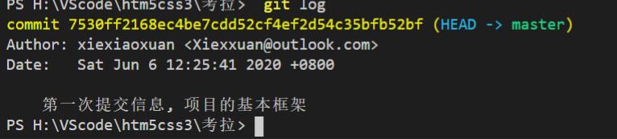

# git/github入门

## 1.GIT版本控制系统

> 版本控制系统:
>
> 1.记录历史版本信息(记录每一次修改记录)
>
> 2.方便团队相互之间协作开发
>
> ....

- svn cvs ：集中式版本控制机

- Git ：分布式版本控制器


## 2.GIt工作原理

+ 工作区： 我们能看到的，并且用来写代码的区域

+ 暂存区： 临时存储用的(功能未完成,暂时存储,不需要形成历史版本)

+ 历史区： 生成历史版本

+ 其实现过程如下:

  + 工作区 => ($ git add -A)暂存区 =>($ git commit -m'')历史区=> ($ git push origin master)/($git pull origin master)<= 中央仓库(github)

    从工作区提交到暂存区，从暂存区提交到历史区：是把内容复制一份从过去的，本区域中依然存在这些信息(只有这样才能对比出哪些文件没有在暂存区，历史区)

  + 无法实现从历史区到暂存区

  

  

## 3.创建仓库,完成版本控制

> 1.创建本地git仓库

```shell
$ git init => 创建本地仓库
//=>会生成一个隐藏文件夹 '.git' (千万不能删除，因为暂存区和历史区还有一些其他的信息都在这里，删了就不是一个完整的仓库)
```

> 2.在本地编写完成代码后(在工具区), 把一些文件提交到暂存区

```shell
$ git add xxx => 把当前文件夹下的xxx文档提交到本地仓库的暂存区
$ git add .  => 把当前目录下所有文档提交到本地仓库/把当前工作区所有最新修改的文件都提交到暂存区
$ git add -A => 把当前工作区所有最新修改的文件都提交到暂存区,.和-A没区别
$ git status  => 查看当前文件的状态,如果输出都是红色的,说明文档都还在工作区,如果是绿色的就是在暂存区,如果看不见东西证明所有修改的信息都已经提交到历史区了
```

>3.把暂存区内容提交到历史区, 形成历史版本, 如果提交多次,会形成多个历史版本,可通过命令查看所有的版本信息, 去拿想要的版本,commit后面对应的就是自动生成的版本号（黄色标记就是对应的版本号）

```shell
$ git commit -m'描述信息: 本次内容的一个描述'

查看历史版本信息(历史记录)
$ git log => 看返回信息中commit后面的版本号,只要用到前面几位数字就行
$ git reflog
```



> 4.拿想要的版本,但是此前的工作区内容,会被全部替换成版本号里面的内容,之前工作区里面的内容就都没有的了,可通过reflog去查看自己进行了哪些历史版本操作,从输出的历史版本去恢复被替换的版本

```shell
$ git reset --hard 版本号 => 获取想要的历史版本,回滚,回滚的版本消失
$ git log => 这个命令查看版本,会发现回滚的版本消失
$ git reflog => 而这个命令查看版本,回滚的版本还在,看自己都执行了哪些历史版本操作,即使当前的历史区已经没有你回滚的历史版本号,但是还是会输出对应的历史版本内容,可进行恢复,但是必须在回滚后发现目前被替换的版本还是需要的,立即进行恢复才行（黄色标记就是对应的版本号）
```

+ git常用命令

```shell
$ git config -l  => 查看git配置信息
$ git config --global -l   =>查看git全局配置信息
$ git status  => 查看当前文件的状态,如果输出都是红色的,说明文档都还在工作区,如果是绿色的就是在暂存区,如果看不见东西证明所有修改的信息都已经提交到历史区了
$git rm --cached <file> =>从缓存区删除 
```


## 4.gitHub

+ 网址 https://www.github.com

+  一个网站（一个开源的源代码管理平台），用户注册后，可以在自己账户下创建仓库，用来管理项目的源代码（源代码是基于git传到仓库的） 

  我们所熟知的插件，类库，框架等都在这个平台上有托管，我们可以下载观看和研究源码 

  1.Settings用户设置  => 创建完一个仓库,最左边的setting,是很重要的一个设置,里面有包括添加协作者或者说删除仓库的操作

  2.创建仓库 

  New repository 》 填写信息 》Readme（对文档说明，看自己情况是否需要）》Create repository

  Setting 》删除仓库Delete this reposity 

  Setting 》Collaborators 设置协作开发人员 

  Code可以查看历史版本信息和分支信息

## 5.本地仓库提交到远程仓库

> 1.建立本地仓库和远程仓库的**链接**

```shell
//=>建立本地仓库和远程仓库的链接
$ git remote -v =>查看本地仓库和哪些远程仓库保持链接
$ git remote add origin [gitHub仓库地址] => 让本地仓库和远程仓库新建一个链接,origin是随便起的连接名,不过一般都用这个online retailers
$ git remote rm origin => 删除关联链接
```

> 2. 将本地仓库里的内容提交到远程仓库

```shell
执行推送到分支(master)的命令git push -u origin master（分支名字master为主分支）
$ git push -u origin master => 推送到分支master,master作为主分支
提交之前最好先拉取
$ git pull origin master => 拉取远程仓库内容,origin是链接名,取什么连接名,用什么,master是主分支
$ git push origin master => 把本地仓库提交到远程仓库(需要输入gitHub的用户密码)
```


## 6.使用gitHub静态页面托管

> 前提: 该静态页面的文件夹下存有index.html文档, 你已经对该静态项目创建了本地仓库,并且同步到了gitHub的远程仓库(即本地跟远程仓库已经有链接了), 下面用 git bash演示

```shell
//=>1.新建一个分支gh-pages,也就是branch gh-pages
$ git branch gh-pages
$ git branch //=> 建立好分支后查看一下
```


> 此时显示表明已经建立了gh-pages分支,但是*号在master上,说明此时分支停留在master上,需要改变当前分支位置,通过指令git checkout来切换到gh-pages上

```shell
$ git checkout gh-pages
$ git branch//=>切换后在查看一下
```


> 星号来到了gh-pages上了,说明已经切换到gh-pages ,我们需要把分支同步到远程仓库,也就是github上面

```shell
$ git push -u origin gh-pages
```

> 最后只要进入对应的远程仓库里,找setting,拉到下方,有个github pages,只要复制链接(下方https://....),那个就是你的url了


+ 这里不得不说一点,你前提条件准备好了,也只需要进入到远程仓库里面,点击setting,拉到对应的github pages, 然后将source下方的None改成master,也能快速的让github来托管静态页面,但是这种方法与上面那种方法不同的是,第一种是通过创建的分支来进行托管的(我的理解就是copy了一份,用copy的那份去在站点显示),而第二种是直接用主分支进行托管的.


+ 顺便提一下, 此刻学到的知识点

  # git push origin 与git push -u origin master的区别

  $ git push origin

  上面命令表示，将当前分支推送到origin主机的对应分支。 

  如果当前分支只有一个追踪分支，那么主机名都可以省略。 

  $ git push 如果当前分支与多个主机存在追踪关系，那么这个时候-u选项会指定一个默认主机，这样后面就可以不加任何参数使用git push。

  $ git push -u origin master 上面命令将本地的master分支推送到origin主机，同时指定origin为默认主机，后面就可以不加任何参数使用git push了。

   不带任何参数的git push，默认只推送当前分支，这叫做simple方式。此外，还有一种matching方式，会推送所有有对应的远程分支的本地分支。Git 2.0版本之前，默认采用matching方法，现在改为默认采用simple方式。(网络上查找,当做知识点记录一下,下方为自己理解)

  + 简单的理解,就是看你当前的分支是否有多个,有多个,当你切换到别的分支上时,就要用$ git push -u origin maste将其设置为当前的进行操作的默认分支,如果是只有一个master分支,用$ git push master 


## 7.真实项目开发--clone

  >  真实项目开发流程： 

  1.组长或者负责人先创建中央仓库（增加协作者） 

  2.小组成员基于 $ git clone 把远程仓库及默认的内容克隆到本地一份 ,然后先安装环境,npm install 

  ​       $git clone [远程仓库git地址] [别名：可以不设置，默认是仓库名] =>可以为克隆的文档另起名字 （一个clone解决三件事：初始化一个本地仓库 git init；和对应的远程仓库也保持了关联 git remote add origin [远程仓库git地址]=>(可通过git remote -v查看,也就是直接将克隆的文件作为本地仓管跟克隆地址远程仓库联系起来了)；把远程仓库默认内容拉取到本地git pull/git push(可简写了)  === git push origin master） 

  3.每个组员写完自己的程序，基于'git add./git commit -m'' ' 把自己修改的内容存放到历史区，然后通过git push/git pull把本地信息和远程仓库保持同步即可（可能涉及冲突的处理）

  ```shell
  //=>实现过程
  1. $git clone [远程仓库git地址] [别名：可以不设置，默认是仓库名]
  2.npm install
  3.开始编写自己负责的代码
  4.提交保存在自己仓库,在提交到github
  git add .
  git commit -m'描述信息'
  git pull
  git push
  ```

  


  ## 提示

  停止终端的命令：

  **在node环境，快捷键：ctrl + c**

  **在ssh环境，输入指令：exit**

  **在git环境，快捷键：q**


## 注意点

> 当我们在github版本库中发现一个问题后，你在github上对它进行了在线的修改；或者你直接在github上的某个库中添加readme文件或者其他什么文件，但是没有对本地库进行同步。这个时候当你再次有commit想要从本地库提交到远程的github库中时就会出现push失败的问题。
>
> 如下图所示
> 我在github库中对某个文件进行了在线的编辑，并且没有同步到本地库，之后我在本地库添加了文件test.txt，并想提交到github，出现以下错误：error：failed to push some refs to。


- 解决方案

  >这个问题是因为远程库与本地库不一致造成的，那么我们把远程库同步到本地库就可以了。
  >
  >使用指令如下:

  ```shell
  git pull --rebase origin master =>这条指令的意思是把远程库中的更新合并到本地库中，–rebase的作用是取消掉本地库中刚刚的commit，并把他们接到更新后的版本库之中。
  ```

  **下图可以形象的解释错误情况的发生和解决**

  

  因为能实现本地到远程或者远程到本地,他们都是通过对比,把不同部分进行处理,而且,不同的是根据主动那一方根据对比得出结果(差异性只能来自一方),就比如说这次的commit的错误问题问题,本地仓库向远程仓库提交,是本地要向远程的传输,那多出的部分应该只有本地有,对比后才能将本地有的远程没有的部分发送给远程,此事由于本地改了,不符合规律,所以报错了,这也就是为什么在push前最好先pull的原因, 毕竟,在github上托管,是允许别人对你这个项目或者工程区建文档,添加文档的.

  > git pull --rebase origin master意为先取消commit记录，并且把它们临时 保存为补丁(patch)(这些补丁放到".git/rebase"目录中)，之后同步远程库到本地，最后合并补丁到本地库之中。

  

  > 接下来就可以把本地库push到远程库当中了。

  

  


  

  

  

