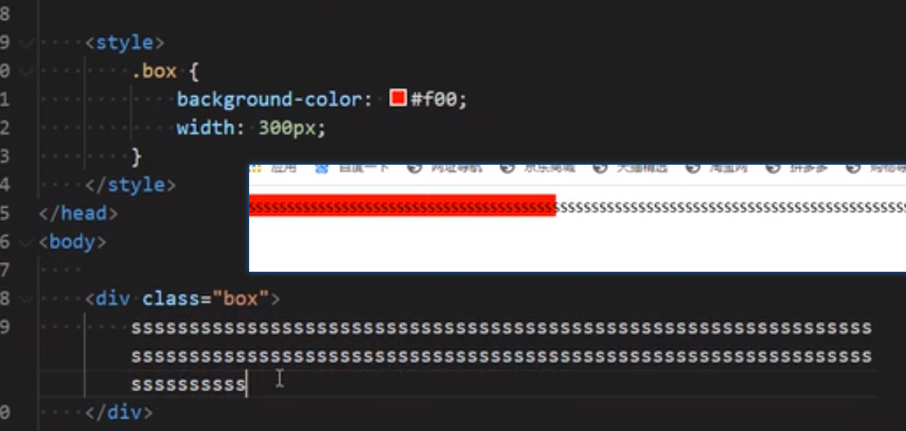
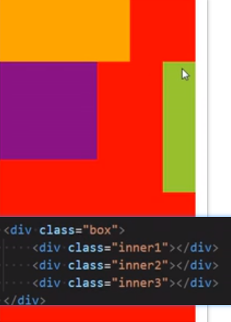
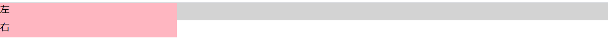

# html和css的补充

> 一个HTML文档包含四部分
>
> <!DOCUTYPE html>
>
> <html lang='en'>
>
> <head>
><body>

### 1. 有些属性是公共的,每一个元素都是可以设置

- 比如class  id  title
  * title属性使鼠标移入会显示出title值

###  2.`<!DOCTYPE html>`

- html文档声明,告诉浏览器当前页面是HTML5页面,让浏览器用HTML5的标准去解析识别HTML文档
- 必须放在文档的最前面,不能省略,省略会出现兼容性问题

### 3.html是HTML文档的根元素,一个文档只能有一个,w3c建议为HTML元素增加一个lang属性,作用是

+ 帮助语音合成工具确定要使用的发音
+ 帮助翻译工具确定要使用的翻译规则

### 4.head元素

> head元素里面的内容是一些'元数据'(元数据: 描述数据的数据) 一般用于描述网页的各种信息,比如字符串编码,网页标题,网页图片

+ 内嵌元素

  + title

  + meta

    * charset
    
  + style

  + link

    + link还能用于引入title的图标

      ```html
      <link rel="icon" href=""></link> //rel => hype reference rel属性值为icon
      ```

      * 网页图标支持图片格式是ico  png 常用大小 16`*`16  24`*`24  32*32 (单位pixel)

    + link元素的rel属性不能省略,用来指定文档与连接资源的关系

    + 一般rel确定,相应的type也会默认确定,所以可以省略type

  + base => base标签最重要的就是href属性,是和a标签搭配使用
    
      ```html
      <!DOCTYPE html>
      <html lang="en">
      <head>
          <meta charset="UTF-8">
          <meta name="viewport" content="width=device-width, initial-scale=1.0">
          <title>Document</title>
          <base href="https://www.baidu.com/" target="_blank">
      </head>
      <body>
          <!--  -->
          <a href="">百度</a><br><!-- 这些都是请求百度下的不同内容,所以只是后部分的参数不同,则可以通过base标签将其相同部分url拿出来 如果a标签里面属性相同,也能拿出来放到base标签里面-->
          <a href="img/bd_logo1.png">百度logo</a>
          <a href="s?wd=vue">搜索vue</a>
          <a href="">百度一下</a><!-- 不给url的a标签会被统一识别成base里面的url -->
          <a href="https://www.taobao.com"></a><!--a标签给了不同的url,会识别自己本身的url,并不影响 -->
      </body>
      </html>
      ```
    
      
    
    + script
    


### 5.URL/SEO优化

#### 5.1 SEO:搜索引擎优化

+ 百度/谷歌/360/Google
+ h元素有助于SEO(Search Engine Optimization)优化,可以促进关键词排名
  * 建议在网页中最多只有一个h1
  * 乱用h元素不仅不会给网站带来好的权重,同时也有可能被搜索引擎认为作弊,最后导致k站

### 6.标签

+ img标签中,绝对路径就是从根路径开始(磁盘),直接在从磁盘上复制的路径用的是反斜杠,事实上,正斜杆才兼容,所以,反斜杠只有windows系统才能识别,是历史遗留问题,所以以后即使用绝对路径,也要用正斜杆才行

+ img标签属性 
  + src
  + alt:当图片失效(加载失败)时显示文本 => 在HTML5规范中,辣条是img元素的必要属性
  
+ a标签中的锚点,用a标签中的src跟其他元素的id对应起来

  + 有时候点击链接的时候并不希望打开新的URL,而是希望干点别的事情,这时候可以使用伪链接,伪链接可以代替按钮 a标签的href属性可以没有内容,但是不能没有写这个属性,否则变为普通文本

    ```html
    <a href='#' onclick='return false; function(){}'>伪链接1</a>
    <a href='javascript:alert()'>伪链接2</a>
    <a href='#'>跳到顶部</a> //只是给个a标签,href='#'会直接跳到页面顶部
    ```

  + a标签的href还能给前缀,实现不同的功能,比如打开邮箱

    ```html
    <a href="mailto:Xiexxuan@outlook.com">qq邮箱</a>//mailto:
    ```

    

  + a标签也不一定只是跳转链接,他也可以用来下载资源,只要你href里面放置的东西是下载资源的地址,就可以进行下载

### 7.css

  css引入的方式有: 内联样式, 文档样式表, 外部样式

+ css作为一个单独的文件 的时候,最好也说明一下编码格式

  ```css
  @charset 'utf-8';
  ```

+ 引入外部文件,除了用link,还可以用@import,但是用link效率更高

  ```html
  <style>
      @import url()
      @import url(./css/02.css);
  </sty>
  ```

+ 选择器种类特别多,大概可以这么归类

  + 通用选择器
  + 元素选择器
  + 类选择器
  + id选择器
  + 属性选择器
  + 组合选择器
  + 伪类选择器
  + 伪元素选择器

+ 驼峰标识

  + 小驼峰: 第一个单词的首字符小写,后面遇到一个单词首字母大写
    * HTML css js函数名
  + 大驼峰: 所有首字母都大写
    * js中定义类的名字

### css样式

1.文字处理

+ text-decoration

  + underline
  + overline
  + line-through
  + none
  
+ letter-spacing:15px

+ word-spacing:20px => 都是可以设置负数的

+ text-transform

  + capitalize => 首字母大写
  + uppercase => 将每个单词变大写
  + lowercase => 将每个单词小写
  + none => 无影响
  
+ text-indent用于设置第一行内容的缩进
  
  + em是相对于自身字体大小来设置的,如果自身大小是16px,则1em = 1`*`16 , 2em =2`*`16
  
+ text-align => 设置元素内容在元素中的水平对齐方式(设置的是元素内容里的东西,不一定是文本内容,但是标签不能是块级标签,块级标签没作用,在一点,它具有继承性,,后代会继承)
  + left
  + right
  + center
  + justify => 使一行占满,调整的是间距,但是对于文本来说最后一行是没用的,如果文本只有一行,也会被当做最后一行,所以没有作用
  + text-align-last : justify => 是最后一行也能平铺占满
  
+ font-size

  每个浏览器都有限制字体最小,像谷歌,最小是12px,给百分比或者是em都是相对其包含块元素的

+ font-family 

> font-family: Arial,"PingFang SC","Hiragino Sans GB",STHeiti,"Microsoft YaHei","WenQuanYi Micro Hei",sans-serif;
>
> 建议: 将英文字体写到前面,中文字体写到后面,为什么有的给引号有的没给,如果字体只是一个单词不需要给引号,如果是多个单词用空格,就要用单引号,如果字体单词之间用了-,就不需要

+ font-style 
  + normal
  + italic 字体倾斜显示(前提是font-family这种字体本身是支持倾斜的)
  + oblique  文本倾斜(让文字倾斜)
+ line-height =>  一行文字所占据的高度 => 两行文字极限之间的间距


  + 行高 = 内容高度+ 行距 ,在css布局的时候,行距会被上下均等分,所以在只有一行内容的时候,可以将行高等于高度实现居中
  + font => 缩写(符合属性)属性
    + font-style  font-variant  font-weight  font-size/line-height  font-family
    + fongt-style  font-variant(小写变大写,但是还是小写的高度)  font-weight可以任意调换也可以省略
    + /line-height 可以省略,如果不省略,必须跟在font-size后面
    + font-family可以省略,但是不能换位置

### 8.选择器

+ 属性选择器

```html
[title] {}
[title = ''] {}
[title* = 'one']//只要title中包含one就被选中
[title^ = 'one' ]//以title中以one开头
[title|='one']//title属性值恰好等于one或者以单词one开头且后面紧跟着连字符号-的元素 => 一般用于lang属性上
[lang|'en'] {
color:red
}
[title~='one'] {} => title属性值包含单词one的元素(单词one与其他单词之间必须用空格隔开)
```

+ 后代选择器/子代选择器

  + ```html
    div span {}//div里面的span元素(包括直接间接子元素)
    div > span{}//div元素里面的直接span子元素(不包快间接子元素)
    ```

  + p标签里面是不允许包div的

+ 相邻兄弟选择器

  + ```HTML
    div + p {}//div元素后面紧挨着的p元素(且div  p元素必须是兄弟关系)
    div ~ p {} //div的所有兄弟中是p元素
    ```

+ 交集选择器/并集选择器

  + >div.one{}//div和.之间没有空格 => div元素  class值有one
    div, .one, [title] {} //所有div元素 + 所有class值有one + 所有title属性值等于test的元素
    
    ```
    
    ```

+ 伪类/伪元素

  + 伪类选择器/pseudo-class

    * ```html
      //动态伪类(dynamic pseudo-class) => 主要 
      :link  :visited  :hover  :active  :focus
      
      link => 未访问状态
      active => 激活的链接(鼠标在链接上长按住未松开)
      :focus => 指向当前拥有输入焦点的元素(能接收键盘输入),其实有些即使不能输入也能获取焦点,比如a标签
      
      //结构伪类
      :nth-child()  :nth-last-child()  :nth-of-type()  :nth-last-of-type()
      :first-child === :nth-child(1)  :last-child === :nth-last-child(1) 
      :first-of-type === :nth-of-type(1)
      :last-of-type === :nth-last-of-type()
      :root  => 根元素,也就是html
      :only-child  => 父元素中唯一的子元素
      :only-of-type  => 是父元素中唯一的这种类型的子元素
      :empty
      
      //否定伪类
      :not()/:not(.text)/:not(span)
      
      //目标伪类 => 用于锚点,比如a标签,可以使a标签点击,给选中的目标加样式,而不选中的会回复,并不需要选中哪个元素或者标签,他会自动匹配到锚点,点击到锚点标签,就会跳到对应的地方,给其加样式
      :target{}
      
      //语言伪类
      :lang()
      //元素状态伪类
      :enable()  :disable()  :checked()
      ```

    动态伪类

    

    必须注意一:

    :hover必须放在:link和:visited后面才能生效

    :active必须放在:hover后面才能完全生效

    推荐使用顺序:link  :visited  :hover  :active

    除了a元素:hover和:active可以应用到其他元素上

    注意二:

    去掉a标签的聚焦状态(按tab键也会使其聚焦,但是通常a标签并不需要聚焦,所以清除a标签的聚焦有方法如下)

    + ```html
    a:focus {
      outline: none;
    }//这个方式,只是去掉当聚焦的时候,多加的样式,会有一个高亮的外边框,input标签也是一样,聚焦都会加了一个高亮的边框,但是这个方法只是外表看起来没变化,但事实上还是聚焦了
      
      ```
    

<a tabindex='-1'></a>//tabindex属性是用来决定按tab选中元素的顺序,只要给-1,就能跳过该标签

      ```
    
      ```
    
    注意三:
      
    访问过后,刷新,为什么还是已访问的状态,因为浏览器存在缓存的情况,即使刷新了,在同一个页面,还是已访问的状态
          ```


      


+ 结构伪类 => 结构选择器,选择是层层递进的
  + nth-child(n/2n/even/2n+1/odd/3n/3n+1/-n+3) => 2n/even都是代表偶数  ,  2n+1/odd代表奇数   ,-n+3代表前三个,说明也可以用负数


p:nth-child(2n+1) => 指是p标签,并且是子元素,他们对于body来说都是子元素,所以选中1,3,5 => 交集选择器

p :nth-child(2n+1) => 指的是p标签下面的子元素且为奇数,所以没有人被选中, => 并集选择器


p:nth-of-type(2)  =>  p标签,排第二,但是这个排名,是必须在同一层级的比较 ,所以内容6是被选中的,在body内来说,内容6跟内容1和来个外层div是在同一层的,所以被选中,而第二个div中的内容5被选中,因为他们也是在同一层的


图片所有内容都被选中的,因为:not(div)是层层查找的,从html,在body,因为在html和body里面都没有div,所以都会被选中

正确应该是:not(html):not(body):not(div)  => 除掉htm,在除掉body,在除掉里面的div元素 ,这样就能选中内容2和内容3

如果是:not(html):  not(body):not(div)  =>猜想: 加个个空格,就谁也选不中了,因为出去html,在其子元素里面进行筛选,html都被排除掉了,哪里来的子元素,所以谁都选不中  =>  结果不对,理解body  :not(body):(div)  => 也只能这样子理解了

 :not()里面不能放符合元素,只能是简单的选择器

+ 伪元素

> :first-line  ==  ::first-line
>
> ::first-letter   =>选中 第一个单词/文字
>
> ::before
>
> ::after
>
> ::placeholder //[伪元素](https://developer.mozilla.org/en-US/docs/Web/CSS/Pseudo-elements)**`::placeholder`**可以选择一个表单元素的[占位文本](https://developer.mozilla.org/en-US/docs/Web/HTML/Forms_in_HTML#The_placeholder_attribute)，它允许开发者和设计师自定义[占位文本](https://developer.mozilla.org/en-US/docs/Web/HTML/Forms_in_HTML#The_placeholder_attribute)的样式。

+ 注意点1

  只有下列属性可以应用在 ::first-line伪元素

    字体属性  颜色属性  背景属性  

    word-space  letter-space  text-decoration  text-transform  line-height

  

  只有下列属性可以应用在:: first-letter伪元素

  字体属性   margin属性  padding属性  border属性  颜色属性  背景属性

  text-decoration  text-transform  letter-spacing   word-spacing  line-height  float  vertical-line

  

+ ::before  ::after用来在一个元素的内容之前或之后插入其他内容(可以是文字  图片content: url();)

  但是有时候用了after或者before,内容没显示出来,可能是因为布局的原因,所以可以给其相对父元素的绝对定位.

### 9.Emment语法

- html:5

- ^上一个层级  => div>span>a+i^strong =>^^回;两个上层级

- div[title='haha']

- $  数字递增  =>  div>span{你好$}*5

- 默认是生成div  =>  .box/#box  =>  <div class='box'></div>,但是如果是在ul里面,则是默认是生成li

- 学完table就知道了

  

  > /* w200+h200+m20+p40 生成如下*/
  >
  > ​      width: 200px;
  >
  > ​      height: 200px;
  >
  > ​      margin: 20px;
  >
  > ​      padding: 40px;
  >
  > m20-30-40-50 => margin值上右下左
  >
  > fz 20/fz20px  => font-size
  >
  > dib => display: 'inline-block'

### 10.css特性

+ 层叠/继承

  + css中有些属性是可以继承的

  + 注意事项

    * css属性继承的是计算值,不是当初编写属性时的指定值(字面值)

      

      即继承后显示的是25px而不是50%,但是都是同一个大小概念

    * css允许多个相同名字的css属性层叠在同一个元素上,但是最后只有一个css属性会生效

      * 同个元素,!important>内联> id > class/属性选择器/伪类 > elemenet/伪元素
      
      * 同个元素不同class,最后只有最后的class会生效
      
      * 但是可以给某个css一个权重,让其生效 !important:1000  => font-size: 15px !important
      
        
    
  + 关于定义列表:dl  dt  dd

    + dl(definition  list)定义列表,直接元素只能是dt/dd
    + dt(definition term)列表中的每一项的项目名
    + dd(definitiondescription) 列表中每一项的具体描述,是对dt的描述,解释,补充
      * 一个dt后面一般跟着1个或者多个dd
    + dt dd常见的组合,dt跟dd是并列关系,不是包含关系
      * 事物的名称  事物的描述

```html
<ul>
        <li>
            <dl>
                <dt></dt>
                <dd></dd>
                <dd></dd>
                <dd></dd>
            </dl>
        </li>
    </ul>
```


  + 列表相关的常见css属性有4个: list-style-type  list-style-image  list-style-position  list-style
    - list-style-type: 设置里元素前面标记的样式
      * dics(实心圆)   circle(空心圆)   square(实心方块)  decimal(阿拉伯数字)   lower-roman(小写罗马数字)   upper-roman(大写罗马)  none(什么都没有)
    - list-style-image:设置某张图片为li元素前面的标记,会覆盖list-style-type的设置
    - list-style-position: 设置li元素前面标记的位置,可以取outside  inside2个值
      * inside是指将左边圆形等小图案计算到内容里面,但是li总是有默认的一个靠左的margin值,这样会使其看起来离左边更远一点
      * outside是不将左边的图案计算到内容里面
    - list-style: list-style-type    list-style-image    list-style-position的缩写属性
      * list-style: outside  url('images/dot.png')/list-style-type
      * list-style:none
+ 表格table => table里面的border属性,是会给table和每个内容加上边框,还颜色有点区别,一般不这么用,cellpadding(单元格内部的间距)  cellspacing(单元格之间的间距)   width(表格的宽度)  align(表格的水平对齐方式,指的是整个表格,而不是表格里面的内容left  center  right) => 这些属性用的都比较少,一般用css样式设置 => border-collapse,合并边框,实现只有一条细边框,这个样式就比较常用,但是前提是给了td都设置了border,才能实现多余的边框ed合并,border-collapse:collapse,此外,border-spacing:10px 15px,是设置表格和单元格之间的距离,两个值,第一个是左右,第二个是上下,功能跟cellspacing是一样的,两者都是table特有的css样式,相比他们tr  td  th自身带的属性,更多用的是css样式来控制
  + tr行  => valign 一整行的垂直对齐方式,但是得在table上设置了height,事实上,你没有设置height,盒子是由内容撑开的,所以空间就那么大,垂直方向就无所谓的对齐方向,所以要给一定的高度,才能设置(top  middle  bottom  baseline)  align单元格的水平对齐方式(left  center right)
  +   td内容,单元格  =>  单元格也能设置width height valign  align  rowspan(单元格横跨的行数,)  colspan(单元格可横跨的列数,)
  + 细线表格的实现 =>  给table的属性border和外联样式border后产生的效果是不一样的,要实现细边框,就要给table设置border-collapse,给td都设置了border,才能实现多余的边框合并,border-collapse:collapse,是css的样式,所以不存在不支持
  + 表格也会有分标题,头部和内容和底部
    * 标题<caption></caption>
    * 头部thead>tr>th
    * tbody >tr>td
    * tfoot
  + 单元格合并
    * 合并要领
      * 合并方向是向右 向下
+ 表单
  - form表单 => 一般情况下,其他表单相关元素都是它的后代元素
    * input  =>行内替换元素,跟img是一样的
      + input中type属性
        + checkbox  text  password file  radio   button submit  reset
      + maxlength属性  => 允许输入的最大数字
      + placeholder =>  占位文字
      + readonly: 只读
      + disabled: 禁用
      + checked: 默认被选选中
      + multiple
      + selected
      + autofocus:当页面架子啊时,自动聚焦
      + name:在提交数据给服务器的时候,会将name值作为key,输入的值作为value传过去
      + value: 值等同于输入的值,也会被提交给服务器
    * 不二属性可以没有属性值,写上属性名就代表使用这个属性
      + 常见的不二属性有disabled  checked   readonly  multiple   autofocus  selected  
  - <fieldset>是设置文本框配合<legend>标签一起使用的
  - ``
  - 关于name  =>  对于radio,name设置会使其只能选择一个,但是对于checkbox,设置name就能多选几个
  - 重置按钮reset  =>  <input type="reset" value>
    + 前提一: type必须是reset类型(value值可以不写,浏览器自动会给添加)
    + 前提二: 所有的表单内容都必须放在form标签里面
  - 按钮实现
    + 方式一: <input type='button' value='按钮'>  => 必须给value值才会显示字,它也是替换元素,会将value值替换过去
    + 方式二: <input type='reset'>
    + 方式三:<button type='reset'>按钮</button>  =>  注意button有一个默认属性,type,默认值是submit
    + <input type='submit'>
    + 关于button这个标签,他的type属性有三个值,分别是button  submit(默认)   reset  => 如果button不是用于提交表单,要将type设置成button才行
  - 关于input里面的信息最后都要提交上去,必须设置name才行,因为提交上去的name值最后会变成url中query的key而我们输入的信息则变成value
  - 表单要进行换行,一帮嵌套div来实现,不要用br
  - label标签跟表单的关系
    * label标签里面有一个for属性,表示为谁服务,只要输入相同的id,就能对应起来
  - radio的使用注意
    + name值相同的radio才具备有单选功能
  - textarea => 这个表示的属性,主要有cols  rows,设置行列数,在一个就是resize:none  => 这个也是比较常用到的,因为要禁止编辑框被缩放,即不给拖拉改变cols和rows
    + resize属性的值有 none(禁止缩放)   horizontal(水平缩放)   vertical(垂直缩放)  both(都可以)
  - select常用属性,multiple,size
    + size一般跟multiple一起使用,multiple会使其全部显示,而size则可以控制显示多少项,其他的项目则是上下拉的形式
  - form =>  表单提交的两种方式
    + 
    + form的常用属性
      + action 用于提交表单数据的请求url
      + method  =>  请求方法 get/post/put/delete   默认是get
      + 提交表单数据时,浏览器发送的是http请求,有2种请求方法可以选择(都是向浏览器发送数据)
        * get => 在请求url后面以?的形式上发给服务器的参数,多个参数之间用&隔开
          + http://www.test.com/login?phone=113&password=123&sex=1  => 由于浏览器和服务器对uel长度有限制,因此在url后面附带的参数是有限制的,通常不能超过1kb
        * post =>  发给服务器的参数全部放在请求体中,可以通过network中查看
      + target => 提交表单后也是和a标签一样要进行页面跳转
      + accept-charset => 规定表单提交时使用的字符串编码(默认值unknown,和文档相同的编码) 这个属性可以不用设置,一般是默认的
      + enctype (encode type)  => 规定了再向服务器发送表单数据之前如何对数据进行编码,跟charset还是有区别的,charset是字符编码,跟浏览器声明要以哪种编码方式解析页面,而enctype是告诉服务器,对我这些上传的数据如何编码
        + enctype取值有三种 application/x-www-form-urlencoded:默认的编码方式
        + multipart/form-date : 文件上传时必须为这个值,并且method必须是post,如果需要上传文件enctype属性不是multipart/form-date,可以通过network查看到上传的文件只有文件名没有地址,服务器是拿不到文件的
  - input的name和value关系,一般input中的id,value和label标签中的for属性,三者的值都是一样的,类似于type属性为radio和checkbox的,虽然不需要value设置看的见得文字,但是form提交的时候,query值的value值需要,就是通过value属性得到的3
    * 

### 11.元素类型的分类

+ 分类

  * 

    * 关于块级元素,给的width和height,是内容的宽和高,但是它本身就是块级元素,所以就是会独占一行

      

  * 

  * 

+ 块级元素的由来  =>  浏览器自动给添加了一个display : block属性

+ css中有个display属性,能修改元素的显示类型,有4个常用值

  + block   inline  none(隐藏元素,不占空间 =>关于none,要理解成,一旦none了,就全部都消失了,当block里面的元素又才有了,盒子的大小也会给撑大)   
  + 
  + inline-block是指对内是block,对外是inline

+ visibility => 能控制元素的可见性,有2个常用值

  + visible:显示元素

  + hidden:隐藏元素

    visibility:hidden; 和display:none;的区别

    visibility:hidden虽然元素看不见了,但元素的框依然还留着,还会占着原来的位置,而display:none不仅元素看不见了,而且元素的框也会被移除,不会占着任何位置 

+ overflow(overflow-x/overflow-y) => 用于控制内容溢出时的行为

  + visible    hidden  scroll  auto(根据是否溢出决定是否提供滚动机制)
  
+ 行内级元素(包括inline-block元素)的代码之间如果有空格,会被解析显示为空格字符串

  建议解决方法,行内元素之间不留空格/用注释替换空格,注释在浏览器不被解析/给其父元素设置font-size为0,空格被当做字符串不会显示,但是内容中的文字也看不见了,需要重新给其对应的标签内容设置fong-size/float(最常用)

  

+ 注意点

  + 元素之间的嵌套关系  =>总结:(一般情况下)

    * 块级元素  inline-block元素

      * 可以包含其他任何元素(比如块级元素/行内级元素/inline-block元素)
      * p不能嵌套其他块级元素
    * 行内元素
      * 不要嵌套块级元素,一般情况下,只包含行内元素

### 12.盒子模型

+ 

  + 内容(content)的相关属性

    * 1. width

         mid-width: 最小宽度,无论内容多少,宽度都大于或等于min-width  => 当浏览器小于此宽度,内容会以最小宽度展示,展示不完的会以滚动条的形式进行查看

         max-width:最大宽度,无论内容多少,宽度都小于或等于mix-width  => 如果块级元素搭配inline-block,会由内容决定宽高,但是给了max-width,超过这个值就会换行

      2. height

         min-height

         max-height

  + 内边距相关属性 padding,上=下与左=右的值如果有一方没有给,就是等同的,如果给了,就按着给的来

  + 注意点:

  + 

    为什么没有换行,因为浏览器默认是将其当做一个单词,所以没有换行,可以用属性word-break:break-all进行断开

  + 上下margin传递(左右是不会传递的) => 子元素将margin-top/margin-bottom传递给父元素

    + margin-top传递  =>  如果块级元素的顶部线和父元素的顶部线重叠,那么这个块级元素的margin-top值会传递给父元素
    + margin-bottom传递 =>  如果块级元素的底部线和父元素的底部线重叠,并且父元素的高度是auto(指父元素不用设置高度,由子元素高度撑开),那么这个块级元素的margin-bottom的值就会传递给父元素(用的比较少)

  + 如何防止传递

    * 给父元素设置padding-top/padding-bottom
    * 给父元素设置border
    * 触发BFC(可以理解为结界)  =>  关于bfc(block format context块级格式化上下文 )
      * 浮动可以触发
      * 设置父元素的overflow为非visible => 最好设置overflow:hiddle(一般父级元素由子元素内容决定,也都不会有超出的情况)
      * 建议
        * margin一般是用来设置兄弟元素之间的间距
        * padding一般是用来设置父子元素之间的间距

  + 上下margin折叠 =>  垂直方向上相邻的2个margin(margin-top/margin-bottom)有可能会合并为1个margin,这种现象叫做collapse(折叠),水平方向不会

    * 折叠后最终值的计算规则  => 两个值进行比较,取较大的值

  + 如何防止margin collapse

    * 只设置其中一个元素的margin

    * 

    * 

      * 这里涉及一个,子设置了margin值,子会传父的margin,父又设置margin,所以会重叠
      * 
    
  + border(边框)
  
  + 边款宽度  border-top-width  border-right-width  border-bottom-width  border-left-width = 简写border-width
  
  + 边框颜色  border-top-color:red
  
  + 边框样式 border-top-style:solid  =>  border-style:none/dotted/dashed/solid/double/groove/ridge/inset/outset
  
  + border: 1px solid  red  => 边框颜色,宽度,样式的编写顺序任意的
  
  + 
  
    + 颜色设置transparent => 透明色
  
+ 行内非替换元素的注意点

  + 以下属性对行内非替换元素不起作用 =>  width height  margin-top  margin-bottom

  + 以下属性对行内非替换元素的效果比较特殊  =>  padding-top  padding-bottom  上下方向的border

    * 

      padding-bottom,虽然有,上下会多出区域但是不会占据空间,不会往下顶

      border-bottom:10px  solid  purple => border的上下也会有区域,但是不占据空间,不会往下顶

      

+ css =>  border_ _ radius

  圆角半径的相关属性有 

  

  

  

  

​            设置border-radius:50%,是指水平方向和垂直方向的值参考的是当前元素的border+padding+width


+ css属性  --  outline
  + outline表示元素的外轮廓
  + 不占用空间
  + 默认显示在border的外面
+ outline相关属性
  + outline-width
  + outline-style: 取值跟border的样式一样,比如solid dotted
  + outline-color
  + outline:outline-width  outline-style  outline-color的简写属性,跟border用法一样
+ 应用实例
  + 去除a元素  input元素的focus轮廓效果


+ box-shadow
  + 

<shadow> = inset ? && <length> {2,4} && <color>?

官方文档意思  box的shadow属性等于  => ?代表可有可没有(0或者1) &&代表与 有尖括号代表要给确定值2~4个,

模糊半径是指在偏移量的基础上继续给个模糊的距离,而延伸距离整个方位上的延伸 ,颜色跟inset(给这个值就是向内阴影)这两个值都是可有可无,并且位置可换,可以尝试给length的第3个和第4个值为0看看效果


可以给多次阴影,用逗号隔开 box-shadow: -10px 10px 5px, 10px 10px 5px red


+ test-shadow => 用法类似于box-shadow,用于给文字添加阴影效果
  + 
  + text-shadow同样适用于::first-line   ::first-letter

+ box-sizing

  + content-box =》 设置的宽度和高度只是指定内容的宽高，padding，border都布置在width和height外边
  + border-box =》 设置宽度和高度是内容+ padding+ 边框宽度,padding,border都布置在width和height里边
  + 
  + 
  + w3c标准盒子模型就是content-box
  + ie8一下浏览器是border-box

+ 水平居中

  + text-align:center
    + 普通文本
    + 行内元素
    + 行内替换元素
    + 行内块级元素(对外是行内元素,对内是块级元素)inline-block
    + 关于block元素,为什么没法让其居中,是因为它是block元素,就是占据一整行,即使给他width和height,那也是内容的大小,元素仍旧占据一整行,所以即使父元素给text-align,也没办法让子元素为block的元素居中,但是因为继承的关系,所以会让子元素的内容居中,那如何让子元素居中呢?解决办法,给为block的子元素设置margin :0 auto

+ 关于margin:auto属性

  margin-left/margin-right的初始值都是0,所以中间多出了的margin值都不进行分配,如果只设置margin-left:auto,则会把所有多余的空间分配给left,margin-right为0,right跟left都设置为auto,就会实现水平的居中(不受父元素的宽高影响),以此类推,top跟bottom应该也是一样的,但是不是的,无法实现垂直方向的居中,因为相比垂直方向居中,有要求,必须让父元素的width为auto,即不给父元素的width设置高度,让子元素去撑开,但这也就没有所谓的垂直方向的居中了,因为父元素和子元素高 度一样大小,都是垂直方向的居中,在一个margin-top:50%,是相对父元素宽的50%,所以,可以查看官方文档

   

  

  auoto

### 13.background

- background-image => 用于设置元素的背景图片,

  + 会盖在(不是覆盖)background-color的上面,就是层叠,而不是替换
  + 可以设置多个背景图片 ,当第一张图片有错误展示不出来,则会展示后面的图片,如果所有图片都能显示,则是一种层叠效果
    * background-image:  url(''),url('')  
    * 设置的第一张图片将显示在最上面,其他图片按顺序层叠在下面
    * 注意:如果设置了背景图后,元素没有具体的宽高(最重要的是高),背景图片是不会显示出来

- background-repeat  =>  用于设置背景图片是否要平铺

  ​        常见的设值有

  * repeat/no-repeat
  * repeat-x/repeat-y

- background-size  => 用于设置背景图片的大小

  +  auto: 以背景图本身大小显示(默认)
  + cover:  缩放背景图片,以完全覆盖铺满元素
  + contain: 等比缩放背景图片,知道宽度或者高度被铺满
  + <percentage> : 百分比,相对于背景区域与图片大小差值
  + length: 具体大小
  + auto,让宽或者高某一方向自动按着图片本来的宽高比计算
  + 

- background-size  => 用于设置背景图片在水平,垂直方向的具体位置

  + 
  + 水平方向还可以设置:left center right
  + 垂直方向还可以设置: top center bottom
  + 如果只设置了一个值,另一个方向默认是center
  + 在一点需要注意的是,这些值,并不是去移动背景,而是将元素对应的center 以及top点和图片对应的center及top点重合起来

- background-attachment

  * scroll: 背景图片跟随元素一起滚动(默认值)(元素内容滚动,背景不懂)
  * local: 背景图片跟随元素以及元素内容一起滚动  => 指浏览器滚动时,元素滚动消失,背景跟着一起滚动消失 (滚动元素,内容滚动,背景滚动)
  * fixed: 背景图片相对于浏览器窗口固定 => (背景固定,元素滚动,所以背景和元素有偏移)

- 图片渐变 =>background: linear-gradient(角度,color1,color2)

  +  0 deg=> 从下往上(垂直方向)渐变
  + 90deg => 从左往右(水平方向)

- background是缩写

  + image  position/size  repeat attachment  color
  + 
  + 需要注意的是,使用background:url()来引入图片,会覆盖背景色,如果使用background-image就不会

- sprite精灵图

  + 使用精灵图好处
    * 减少网页的http请求数量,加快网页响应速度,减轻服务器压力
    * 减小图片总大小
    * 解决了图片命名的困扰,只需要针对一张集合的图片命名

- background-img 和img的选择

  + 

- cursor 

  + 

### 14.position

+ 标准流(normal 的flow)

+ 默认情况下,元素都是按照normal flow (标准流 常规流  文档流 )进行排布

  + 从左到右,从上到下按顺序摆放好
  + 默认情况下 互相之间不存在层叠现象
  + 在标准流中,可以使用margin  padding对元素进行定位,其中margin还可以设置负数,但是比较明显的缺点是: 设置一个元素的margin或者padding ,通常会影响到标准流中其他元素的定位效果,不便于实现元素的层叠效果

+ position  =>  利用position可以对元素进行定位,常取值有四个

  + static: 静态定位
    * position默认值 => 元素按照normal flow 布局 
    * left/bottom/top/right没有任何作用
    * 元素按照正常流布局(默认值)
  + relative: 相对定位

    * 

    * 元素是按照正常流布局的,给其相对定位,就是相当于该元素四周有堵墙,在墙内进行移动,像bottom/left/top/right是向上/右/下/左(正值)移动,但是原来的位置,还占据着空间,所以不影响布局,移动后的,有可能会遮住正常流里面的元素

    * 应用场景 => 在不影响其他元素位置的前提下,对当前元素位置进行微调,在一个,仍旧可以给元素添加margin/padding,给其添加margin属性,也是对偏移后的元素来说

      希望图片能随浏览器变化一直居中显示

      + 图片向左移动的距离: = 图片宽度 X 0.5 - div宽度 X 0.5 =  向左移动图片的一半  +  向右移动div的一半 
      + 用相对定位最好做了,将超出的部分隐藏,在给个最小宽度
      + 

  + absolute: 绝对定位

    * 可以通过left right top bottom进行定位
      * 定位参照对象是最邻近的定位祖先元素(指元素有position属性,值不为static)
    * 如果找不到这样的祖先元素,参照对象是视口

    - 子绝父相

      * 在绝大多数情况下,子元素的绝对定位都是相对于父元素进行定位
      * 如果希望子元素相对于父元素进行定位,又不希望父元素拖标,常用解决方案是:
        * 父元素设置position:relative(让父元素成为定位元素,又不脱离文档流), 子元素设置position:absolute => 简称'子绝父相'

    * 绝对定位元素(absolute position element)  => position值为absolute或者fixed的元素
    * 对于绝对定位元素来说  =>  定位参照物对象的宽度 = 绝对定位元素的 left + right + margin-left(默认为0)  + margin-righ(默认为0)  + 绝对定位元素的实际占用宽度
    * 对于绝对定位元素来说  =>  定位参照物对象的高度 = 绝对定位元素的 top + bottom + margin-top  + margin-bottom  + 绝对定位元素的实际占用高度
    * 有了公式,这样子对于绝对定位的元素就可以实现居中 => 比如
      * 父元素相对定位的宽度为600,高度为600,绝对定位子元素宽度200,高度200,则只要设置绝对定位子元素的left:0,right:0,margin-left:auto,margin-right:auto(其实只要left跟right的值相等就行了)
      * 只要left:0,right:0,就能实现没有内容也能铺满
      * 

  + fixed:  固定定位

    * 可以通过left  right top  bottom 进行定位
    * 定位参照对象是视口(即浏览器的可视区域,不包括导航栏啥的)
    * 当画布(整个html内容)滚动时,固定不动

+ 脱标元素的特点

  + 脱离标准流的元素 => position: fixed/absolute ,float
  + 可以随意设置宽高(大部分元素) => 脱离标准流的元素大部分都变成了block元素
  + 宽高默认由内容决定(大部分元素) => 既然已经脱离了文档流,自然width/height不在继承body,不占一行,而是由内容撑开,即元素的宽高就等于内容的宽高
  + 不在受标准流的约束
  + 定位元素,如果想对的元素有边框,是以下边框进行定位的
  + 不在给父元素汇报宽高数据 => 就是标准流里面没有你的位置了
  + relative给百分比 => 指最近的父元素的大小 X 百分比(top => 百分比X父元素height  left => 百分比X父元素width),最近元素不管是行内元素还是块级元素,所以给百分比的前提是定位父元素有固定的宽高

+ 

+ 

+ z-index属性用来设置定位元素的层叠顺序(仅对定位元素有效)

+ 


### 15.float布局

+ 在css中,有3中常用的方法对元素进行定位,布局

  + normal flow : 标准流 常规流  文档流

  + absolute position: 浮动

  + 绝对定位  浮动都会让元素脱离标准流,以达到灵活布局的效果
  
+ float的常用取值

  + none :不浮动 默认值
  + left向 :左浮动
  + right: 向右浮动
  
+ 浮动的规则

  + 规则一  
    * 元素一旦浮动后,脱离标准流
    * 朝着向左或向右方向移动,直到自己的边界紧贴着包含块(一般是父元素) 或者其他浮动元素的边界为止
    * 定位元素会层叠在浮动元素上面
  + 规则二
    + 浮动元素不能与行内级内容层叠,行内级内容将会被浮动元素推出
      * 比如行内级元素  inline-block  块级元素的文字内容
        * 利用此特性,可以轻松实现文字环绕功能  => 在div里面放了图片及一大堆文字,但是图片会浮动到div的边缘,又不用向div汇报自己的高度,还会将文字挤出去,只要再给div设置宽度,就会实现环绕效果
  + 规则三
    + 行内级元素,  inline-block元素浮动后,其顶部将与所在行的顶部对齐(及,只在自己的这一行里浮动,不会越行,向左或者向右)
  + 规则四
    + 如果元素向左(右)浮动,浮动元素的左(右)边界不能超出包含块的左(右)边界
  + 规则五
    * 浮动元素之间不能层叠
      + 如果一个元素浮动,另一个浮动元素已经在那个位置了,后浮动的元素将紧贴着一个浮动元素(左浮找左浮,右浮找右浮)
      + 如果水平方向剩余的空间不够显示浮动元素,浮动元素将向下移动,知道有充足的空间为止
  + 规则六
    + 浮动元素的顶端不能超过包含块的顶端,也不能超过之前所有浮动元素的顶端
  + 浮动的规则
    + 浮动元素的顶端不能超过包含块的顶端,也不能超过之前所有浮动元素的顶端(即如果都浮动了,最后一个浮动,即使空间够,也将会和倒数第二个排齐,而不会与之前的并齐)
      + 如下面的例子,三个都给了左浮动,最后的绿色是跟倒数第二个紫色的并齐,而不会跟第一个的并齐
      + 
      + 

  + 层叠关系

    * 标准元素: 标准流中的元素是不存在层叠

    * 定位元素:定位元素会层叠到标准流上面

      + 定位元素之间可以z-index
      + 前提:必须是定位元素 -- 非static

    * 浮动元素:float: left/right

    * 标准元素  ->  浮动元素  ->  定位元素
  
+   关于margin负值  =>  可以实现多出部分的margin值
  + ['margin-left'](https://www.w3.org/TR/CSS2/box.html#propdef-margin-left) + ['border-left-width'](https://www.w3.org/TR/CSS2/box.html#propdef-border-left-width) + ['padding-left'](https://www.w3.org/TR/CSS2/box.html#propdef-padding-left) + ['width'](https://www.w3.org/TR/CSS2/visudet.html#propdef-width) + ['padding-right'](https://www.w3.org/TR/CSS2/box.html#propdef-padding-right) + ['border-right-width'](https://www.w3.org/TR/CSS2/box.html#propdef-border-right-width) + ['margin-right'](https://www.w3.org/TR/CSS2/box.html#propdef-margin-right) = width of [containing block](https://www.w3.org/TR/CSS2/visudet.html#containing-block-details)
    * 如果margin-left或者margin-right给了负值,会产生不一样的效果,比如如果包含块是auto,即使父元素宽高给了定值,包含块margin给了负值,就会使包含块获得比他父元素大的宽高
    * 
  
+ 浮动存在的问题

  + 由于浮动元素脱离了标准流,变成了脱标元素,所以不再向父元素汇报高度,而父元素计算总高度时,就不会计算浮动子元素的高度,导致了高度坍塌的问题,解决父元素高度坍塌问题的过程,一般叫做清浮动(清理浮动,清除浮动)

  + 清除浮动的常见方法

    * 给父元素设置固定高度(不推荐,扩展性不好,习惯不设置高度,让内容去撑起,因为不确定后面内容还剩下多少,所以会产生高度坍塌的问题)

    * 在父元素里最后增加一个br标签(子元素),引用br标签中的clear属性: <br clear='all'>  => 会增加很多无意义的空标签,维护麻烦,违反了结构与样式分离的原则(不推荐)

    * 在父元素外/里最后增加一个空的块级子元素(子/兄弟关系),并且让他设置clear: both  =>会增加很多无意义的空标签,维护麻烦,违反了结构与样式分离(不推荐)

    * 给其加一个自定义的清除浮动的类 => 通过伪类来设置生成一个元素,但是伪类元素是行内元素,所占据的空间仅由内容决定, 不能实现浮动的清除,所以需要给给display,以后哪个盒子需要清除浮动,就给其添加这个类(推荐)

      ```html
      .clear-fix::after{
          content: '';
          clear: both;
          display: block;
          height: 0 //为了兼容浏览器,有些早期的浏览器对伪类元素会给一定的高度
          visibility: hidden;//为了兼容浏览器,因为有些浏览器还是会看的见,所以让其隐藏起来
      }
      .clear-fix{
          *zoom:1; //为了兼容ie6~7浏览器,这个属性已经很少见了
      }
      ```

      + 浮动与定位不能同时使用,float和position

  + 关于居中的实现

    ```css
    //方式一
    .parent{//前提是直接父元素必须有固定的宽高
        height: 100px;
    }
    .son{
        positive: relative;
        top: 50%;
        transform:traslate(0,-50%)
    }
    //方式二
    .parent{
        positive: relative;
    }
    .son{
        position: absolute;
        top: 0;
        bottom: 0;
        margin: auto 0;
        
    }
    ```

    

  + clear  => css属性

    * 常用取值
      * left: 要求元素的顶部低于之前生成的所有左浮动元素的底部
      * right: 要求元素的顶部低于之前生成的所有右浮动元素的底部
      * both: 要求元素的顶部 低于之前生成的所有浮动元素的底部
      * none: 默认属性,无要求

### 16.transform 动画

css的transform属性允许你旋转,缩放,倾斜或平移给定元素,transform(形变transformer => 变形金刚)

 transform: translate(x,y)也是css属性,不同的是,其名都是transform,值是各个函数

+ 常见的函数transform function有:

  * translate(x,y) => 平移  

    * 值
    * 百分比  => 参照元素本身的宽高(refer to the size of bounding box)

  * scale(x,y)  => 缩放

    * 值个数  =>  2个值,如果只给一个值,默认y == x,从而使得元素在保持原有形状下均等缩放,并不是只进行x轴缩放,y轴不进行缩放,如果要只进行x轴缩放transform: scale(2,1)

    * 在一个,它是以中心点四周向外扩,或者向内缩进行缩放的,如果旁边挨着有元素,进行缩放会将遮住元素,如果靠着浏览器边界,则会被剪切掉一部分

    * 值类型  =>  数字(不是px)

      * 1: 保持不变
      * 2: 放大1倍
      * 0.5: 缩小一半

      => 百分比(不支持)

  * transform-origin  => 变形原点

    * 一个值: 设置x轴的原点
    * 两个值: 设置x轴和y轴的原点
    * 必须是<length>,<percentage>,或left,center ,right,top,bottom关键字中的一个
      * left,center,right,top,bottom
      * length:从左上角开始计算
      * 百分比,参考元素本身大小

  * ratate(deg)  => 旋转值

    * 一个值,表示旋转的角度
    * 值类型
      * deg: 旋转的角度,正数为顺时针,负数为逆时针
      * 注意: 旋转的原点受transform-origin的影响

  * skew(deg,deg)  => 倾斜

    + 值个数
      * 一个值: 表示x轴上的倾斜
      * 两个值, 表示x轴和y轴上的倾斜(x轴是指水平两条线的倾斜,垂直是指垂直的两条线的倾斜)
      * 
    + deg: 旋转的角度,正数顺时针,负数逆时针
    + 注意:旋转的原点受transform-origin的影响
- transition  => 过度动画(过度)
  + transition  css属性是transition-property, transition-duration, transition-timing-function和transition-delay的一个简写属性
  + transition-property: 指定应用过度属性的名称(css中,是哪个属性要进行动画,比如width,height,transform,但并不是所有的css属性都可以应用动画,一般是给all,让能进行动画属性的都进行动画属性)
    * 可以写all表示所有可动画的属性
    * 属性是否支持动画查看文档
  + transition-duration: 指定过度动画所需要的时间,单位可以是ms/s
  + transition-timing-function: 指定动画的变化曲线ease-in/ease/ease-in-out/linear/step-start
- transform对于inline元素是无效的,但是对于inline-block和inline-replace是有效的


- 关键帧动画

  transition用于进行过度动画,但是过度动画只能控制首尾两个值,从关键帧动画的角度相当于只是定义了两帧的状态:第一帧和最后一帧,如果我们希望可以有更多状态的变化,可以直接使用关键帧动画

  * 关键帧动画使用@keyframes来定义多个变化状态,并且使用animation-name来声明匹配

    * 1.使用@keyframes创建一个规则
    * 2.@keyframes中使用百分比定义各个阶段的样式
    * 3.通过animation将动画添加到属性上

  * 另外,也可以使用from和to关键字

    * from相当于0%
    * to相当于100%

  * animation:可以给多个动画,用逗号隔开

    ```html
    * .box:hover{
    
       animation:test1 2s liner, test2 2s linear;
    
      }
    @keyframes test1{
    0%{ transform: translate(1,1) scale(0.5);}//但是你应该知道的是,两个动画不要有一样的,比如一个给transform: translate(1,1),一个给transform:scale(0.5),会把样式层叠了,而不是合并
    25%{}
    50%{}
    100%{}
    }
    @keyframes test2{
    0%{ font-size: 15px;}
    25%{}
    50%{}
    100%{}
    }
    ```

    animation的值有如下,值1:使用的关键字帧动画名称; 值2:动画执行的时间;值3:动画速率

  * css animation属性是animation-name, animation-duration, animation-timing-function, animation-delay, animation-iteration-count, animation-fill-mode和animation-play-state属性的一个简写属性形式

    * animation -name : 指定执行哪一次关键帧动画
    * animation-duration: 指定动画多久完成
    * animation-timing-function:指定动画变化的速度曲线
    * animation-delay:指定延迟多久后执行动画
    * animation-iteration-count: 指定动画执行的次数,执行infinite表示无限循环
    * animation-direction: 指定方向,常用值normal和reverse
    * animation-fill-mode: 执行动画最后保留哪一个值
      * none: 回到没有执行动画的位置
      * forward是: 动画最后一帧的位置
      * background: 动画第一帧的位置
    * animation-play-state: 指定动画运行或者暂停(在JavaScript中使用,用于暂停动画)


+ 3D动画
  + css实现3D(兼容性不好):
  + transform-style: preserve-3d => 用于父元素,开启3d效果
  + perspective: 1000px  => 开启视距,主要是用于body里面的,有个距离差.开启z轴才有效果
  + 实现3d效果主要是看z轴的变化.
+ js库实现3D的库:
  + three.js


### 17.vertical-align  

- vertical-align会影响行行内级元素在一个行盒中垂直方向的位置
  + 应该知道,没有内容,,没有高度,有内容,内容撑起高度  => div没有设置高度的时候
  + 内容撑起来高度的本质是由内容的行高撑起来的
  + 行高可以撑起来是因为line boxes的存在,并且line-boxes有一个特性,包裹每行的inline level(即会将所有内容都包裹起来)而其中的文字是由行高的,必须将整个行高包裹进去,才算包裹整个line-level
  + baseline对齐
    * 文本的baseline是字母的x的交叉点,但不是中线
    * inline-block默认的baseline是margin-bottom的底部(没有,就是盒子的底部)
    * inline-block有文本时,baseline是最后一行文本的x的下方
  + vertical-align 的不同取值
    * baseline: 基线对齐(默认)
    * top:  把行内级盒子的顶部跟line boxes顶部对齐
    * middle:  行内级盒子的中心点与父盒基线加上x-height一半的线对齐
    * bottom:  把行内级盒子的底部跟 line boxes底部 对齐
    * <percentage> : 把行内级盒子提升或者下降一段距离(距离相对于line-height计算元素高度),0%意味着同baseline一样
    * <length>:  把行内级盒子提升或者下降一段距离,0cm意味着同baseline

### 18.filter (在css中翻译为滤镜)

- filter CSS属性将模糊或颜色偏移等图形效果应用于元素。滤镜通常用于调整图像，背景和边框的渲染。
- filter的值有很多,但是都是函数,可以实现背景,或者图片的一些改变,可以直接将我们想要用的函数值在MDN里面查找,会更详细些

### 19.HTML5和CSS3的概念

- HTM5分狭义说法和广义说法
  + 狭义的HTML5说的是HTML新的元素和属性
  + 广义的说法说的是HTML5的新的标准,包括最新的HTML元素+CSS新特性+Javascript
- CSS3目前并不存在真正意义上的css3,只是对某些Module Level 3的统称

### 20.HTML5语义化元素

- HTML5新增了语义化元素:
  
  + <header>: 头部元素  <nav>:导航元素  <section>:定义文档某个区域的元素  <article>:内容元素  <aside>: 侧边栏元素  <footer>:尾部元素


+ 媒体元素-video(对播放的视频是有限制的 ,视频的格式为mp4/avi/webm)

  + src  

  + controls:增加控制工具栏

  + autoplay:自动播放,但是存在兼容性问题

  + muted:静音,增加后不静音并且自动播放会生效(存在兼容性问题 )

  + loop: 循环播放

  + <source>元素

    + 如果存在兼容性问题(视频格式的兼容性),可以将多个视频格式的数据源放到source元素中,

    + src:通过src指定数据的来源

    + ```html
      <video src controls muted></video>//方式一
      <video controls>//如果第一个能显示,就显示第一个,不行就往后面
          <source src='../.mp4'>
          <source src='../.avi'>
          <source src='../.webm'>
      </video>
      ```

+ video元素用于在文档中表示音频内容,样式跟video一样,同样可以用source

+ input元素扩展

  + placeholds
  + multiple:多个值
  + autofocus:最多输入的内容
  + 另外对于input的type值也有很多扩展
    * data:日期
    * time:时间
    * number:只能输入数字
    * tel
    * color:取色板
    * email
    * 等等

### 21.flex布局

- flex 布局是目前web开发中使用最多的布局方案
  + flex布局(Flexible布局,弹性布局)
  + 目前特别在移动端用的最多,目前PC端也使用越来越多了
  
- 两个重要概念:
  + 开启了flex布局的元素叫flex container(一般是父元素)
  + flex container 里面的直接子元素叫做flex items
  
- 设置display属性为flex或者inline-flex可以成为 flex container
  + flex: flex container 以block-level形式存在
  + inline-flex: flex container 以inline-level形式存在
  
- flex布局模型,需要理解的一些概念

  + 一旦将盒子设置为flex弹性盒子,不管里面的内容是块级还是行内级,怎样排布,怎样布局,都是有flex说了算

  + 分主轴(main axis)和交叉轴(cross axis),主轴也有尺寸(main size),交叉轴也有尺寸(cross size),主轴有起始点和结束点(main star/end),交叉轴有起始点和结束点(cross star/end),主轴和交叉轴默认情况下,是从上往下,从左往右

    

- flex相关属性

  + 应用在flex container上的css属性

    * flex-flow: 是flex-direction||flex wrap的简写,可以省略,顺序任意

    * flex-direction:是决定主轴的方向,主轴的方向是决定flex items排列的方式(想让flex去自己分配,flex container必须给宽度才行)

      * flex items默认都是沿着main axis(主轴)从main star开始往main end方向排布(紧贴着)

      * flex-direction决定了main axis的方向,有四个取值

        

        * row(默认值):从左向右
        * row-reverse: 相反
        * column:从上到下
        * column-reverse

    * flex-wrap:

      * nowarp:不换行(单行), 默认情况下,所有的flex items都会在同一行显示
      * wrap: 换行(多行)
    * wrap-reverse: 多行(对比wrap,cross start与cross end相反)
  
    * justify-content: 决定了flex items 在main axis上的对齐方式
  
      + 1.flex-start(默认值):与main start对齐 => 就是main star在哪,flex-items就从哪开始紧贴着排布
  
      + 2.flex-end: 与main end对齐
  
      * 3.center:居中对齐 =>在中间紧贴着排列 
  
      
  
      * 4.space-between:(两边没有距离)
  
        * flex items之间的距离相等
        * flex items最左和最右与main start、main end两端对齐
  
        
  
      * 5.space-evenly:(两边距离等于flex-items之间的距离)
  
        * flex items之间的距离相等
        * flex items与main start、main end之间的距离等于flex items之间的距离
  
        
  
      * 6.space-around:(两边的距离等于flex-items之间距离的一半)
  
        * flex items之间的距离相等
        * flex items与main start、main end之间的距离是flex items之间的距离的一半
  
        
  
    * align-items: 决定了flex items在cross axis上的对齐方式
  
      * normal: (默认值,在flex items没给高度的时候)在弹性布局中,效果和stretch一样(就是当flex items没给高度,flex items 会被拉伸到flex container的高度)
      * stretch: 当flex items在cross axis方向的size 为auto时,会自动拉伸至填充flex container
      * flex-start: (默认值,在flex items给了高度)与cross star对齐
      * flex-end: 与cross end对齐
      * center: 居中对齐
      * baseline: 与基准线对齐 (在大部分时候跟flex-start类似,因为里面字体的大小一样大,不同大小就不一样),第一行为准
  
      
  
      
  
    * align-content: 决定了多行flex items在cross axis上的对其方式 ,用法与justify-content类似,在多行的时候,没给这个属性,如何画分是由浏览器决定,一般就是对半分,比如说,有两行,就把父盒子距离分成两半,然后其他东西都以默认的情况显示
  
      * stretch(默认值): 与align-items的stretch类似,有高度的时候,该属性是没用的
      * flex-start:与 cross start对齐(垂直方向会紧贴)
      * flex-end: 与cross end 对齐(垂直方向会紧贴)
      * center: 居中对齐
      * space-between: 
        * flex items之间的距离相等
        * flex items第一个和最后一个与cross start/end两端对齐,
      * space-around:
        * flex items 之间的距离相等
        * flex items与cross stars/end之间的距离是flex items之间距离的一半
      * space-evenly:
        * flex items 之间的距离相等
        * flex item是与cross start/end之间的距离等于flex items之间的距离
  
  + 应用在flex items上的css属性
  
    * flex: 是flex-grow||flex-shrink||flex-basis的简写,flex属性可以指定1个,2个或3个值
    
    
    
    ```css
    flex:1;//可以实现铺满=> flex-grow: 1,没设置宽高,但是,他会根据浏览器窗口的大小,或者盒子的大小,将剩余的铺满
    flex-shrink: 0//可以实现不缩小
    ```
    
    
    
    * flex-grow: 决定了flex items如何扩展
      * 可以设置任意非负数字(正小数,正整数,0),默认是0
      * 当flex container在main axis方向上有剩余size时,flex-grow属性才会有效
      * 如果所有flex items的flex-grow综合sum超过1,每个flex item扩展的size为=> flex container的剩余size*flex-grow/sum
      * 如果所有flex items的flex-grow总和不超过1(依旧有剩余),每个flex item扩展的size为 => flex container的剩余size*flex-grow
      * flex items扩展后的最终size不能超过max-width\max-height
    * flex-basis: 用来设置flex items在main axis方向上的base size(简单理解就是内容盒子的宽度,可替换width,优先权高于width)
      * auto(默认值, ==width)
      * 具体的宽度值(100px)
      * 决定flex items最终base size的因素,从优先级高到低
        * max-width\max-height\min-width\min-height>flex-basis>width\height>内容本身的size
    * flex-shrink(收缩):决定了flex item如何收缩
      * 什么时候会收缩,当你不换行,但是内容多,盒子的宽度即使固定也会被压缩
      * 可以设置任意非负数(正小数,正整数,0),默认值是1
      * 当flex items在main axis方向上超过了flex container的size,flex-shrink属性才会有效
      * 如果所有flex items的flex-shrink总和sum超过1,每个flex item收缩的size为
        * flex items超出flex container的size/sum*每个flex-shrink值
      * 如果所有flex items的flex-shrink总和sum不超过1(收缩不完,内容会有超出),每个flex item收缩的size为
        * flex items超出 flex container的size*flex-shrink值
        * 收缩比例 = flex-shrink*flex item的base size(未收缩的尺寸)
      * flex items收缩后的最终size不能小于敏-width\min-height
    * order: 决定了flex items的排布顺序
      * 可以设置任意整数(正整数,负整数,0),值越小越排在前面,默认值是0
    * align-self: 可以通过align-self覆盖flex container设置的align-items
      * auto(默认值): 遵从flex container的align-items设置
      * stretch, flex-start, flex-end, center, baseline, 效果跟align-items一致

### 22.网络字体的使用

- 浏览器解析字体,一般是从我们本地系统去查找,也可让其先区下载字体到浏览器里面,可以在本地下载,也可以到网络上下载,就看你的url(),其使用是在样式里给,@font-face可以让网页支持网络字体(web font),不在局限于系统自带的字体

  @font-face{font-family:' ';//给下载的字体命名  src:url('')//}

  //可以引用多个格式的字体,单第一个失败,就使用第二个,因为浏览器对每种格式的字体不一定全部都兼容,但是不能引用多种字体

  @font-face{font-family;''

  ​                      src:url('./font/Muyao-Softbrush.ttf'),

  ​                            url('./font/Muyao-Softbrush.eot')

  }

- 常见字体种类

  + TrueType: 扩展名 .ttf
  + OpenType: 扩张名是.ttf/.otf,建立在TrueType字体上
  + EmbeddedOpenType字体: 扩展名是.eot,OpenType字体的压缩版
  + SVG字体: 扩展名是.woff,建立在TrueType字体之上
  + web开放字体: 扩展名是.woff,建立在TrueType字体智商

- 并不是所有浏览器都支持以上字体,使用时要多加测试

- 字体图标 : 用字体来表示图标(这样子就可以任意设置图标的颜色,大小,可以从阿里的icon里面拿)

  * 引入的方式,从本地下载后的压缩包里面包括.css,和各种字体,你可以直接引用.css,或者给类,也可以引用其字体
  * 放大不会失真,可以任意切换颜色
  * 用到多个图标时,文件相对图片较小

### 23.浏览器私有前缀

- 浏览器的私有前缀,只有对应的浏览器才能被解析使用
  + -o- , -xv- : Opera等
  + -ms-, mso- : IE等
  + -moz-: Firefox等
  + -webkit-: Safari, Chrome等
- 官方文档给出的专业术语叫做: wendor-specific extensions(供应商特定扩展)

### 24.文字特殊处理

- white-space用于设置空白处理和换行规则

  + normal: 合并所有连续的空白,允许单词超屏时自动换行

  + nowrap: 合并所有连续的空白,不允许单词超屏时自动换行
  
- text-overflow通常用来设置文字溢出时的行为(处理那部分不可见的内容)

  + clip: 溢出的内容直接剪裁掉(字符可能会显示不完整)
  + ellipsis: 溢出那行的结尾处用省略号表示

- text-overflow生效的前提是overflow不为visible(overflow默认是visible)
  
- 实现让一个固有宽度的元素永远只显示一行文字,并且溢出结尾处显示省略号.
  
  ```html
  white-space: nowrap;
  overflow: hidden;
  text-overflow: ellipsis
  ```
  
- 实现两行显示不完省略

  ```html
  display: -webkit-box;
  -webkit-line-clamp:2;//可通过mdn查看line-clamp,设置显示行数,与之需要配置的东西
  -webkit-box-orient: vertical;
  text-overflow: ellipsis;
  overflow: hidden;
  ```

  

### 25.移动端的适配

- 总结一下,关于昨天看了那么多文档,关于px

  + 关于物理/设备px(DP),是每个设备一生产出来的就确定的参数

  + 而对于web来说的px,是指相对px,并不是一个确定值,它要看你放在哪个设备上,确切的说是受PPI的影响,每个设备的以及受设备像素比例的影响,简单理解就是在每个设备上不同,因呈现 的比列不同也会受影响,

  + 几点概念

    * PPI: 每英寸多少像素,更确切的说法应该是像素密度，也就是衡量单位物理面积内拥有像素值的情况.

      `PPI` 说的是像素密度，而分辨率说的是块屏幕的像素尺寸，譬如说 1334*750 就是 iPhone（6~7）的分辨率，说 iPhone（6~7）的分辨率是 326 是错误的表述，326 是它的像素密度，单位是 `PPI`。其计算公式是求对角线在除以尺寸

    ```
    var 斜边尺寸 = V(1920^2+1080^2) V代表开根号 
    var ppi = 斜边尺寸/5.5 
    ppi = 401ppi
    ```

    * DPI: 每英寸多少点 => PPI和DPI在描述显示器时是一个概念
    
    * DP: 设备/物理像素  **设备像素比(dpr)**，公式为`1px = (dpr)^2 * 1dp`，可以理解为1px由多少个设备像素组成；
    
    * DPR: 设备像素比 == 设备像素/css像素
    
    * CSS像素: 设备独立像素,逻辑像素 
    
    * DIP: 设备独立像素 == CSS像素
    
    * DPR == devicePixelRatio = 物理像素/设备独立像素 => 对于某些高清屏来说,devicePixelRatio=2,所以就会涉及到当给border时候显示出来会比较粗的问题(布局却没问题,着实不是很理解,或许理解的也不一定对),解决方案如下:
    
      ```html
      .setOnePx{//1条border
        position: relative;
        &::after{
          position: absolute;
          content: '';
          background-color: #e5e5e5;
          display: block;
          width: 100%;
          height: 1px; /*no*/
          transform: scale(1, 0.5);
          top: 0;
          left: 0;
        }
      }
      
      .setBorderAll{//4条border
           position: relative;
             &:after{
                 content:" ";
                 position:absolute;
                 top: 0;
                 left: 0;
                 width: 200%;
                 height: 200%;
                 transform: scale(0.5);
                 transform-origin: left top;
                 box-sizing: border-box;
                 border: 1px solid #E5E5E5;
                 border-radius: 4px;
            }
          }
      
      ```
    
      
    
    * 1in(英寸) = 2.54cm= 25.4mm = 72pt = 6pc

- 而关于meta标签

  ```html
  <meta name="viewport" content="width=device-width, initial-scale=1.0">
  ```

  如果不设置meta,view会有个默认的viewport,980px,我们写的px布局,会呈现在这个980的viewport上面,最后根据比例呈现在设备上,所以会出现缩小以及布局错乱的情况

  + 而width=device-width,这里涉及到viewport的三个概念了
    *  **layout viewport**, 理解就是整体页面布局,通过window.innerWidth可得到,也可通过document.documentElement.scrollWidth得到
    * **visual viewport**, 理解就是浏览器窗口,当前页面一屏幕（可视化）区域的宽高,并不包含导航条啥啥的, 可通过document.documentElement.clientWidth ||document.body.clientWhidth获取
    * **ideal viewport**, 最理想的视口,也就是layout viewport  ==  visual viewport
  + [ppk大神](http://www.quirksmode.org/)对于移动设备上的viewport第一篇](http://www.quirksmode.org/mobile/viewports.html)，[第二篇](http://www.quirksmode.org/mobile/viewports2.html)，[第三篇](http://www.quirksmode.org/mobile/metaviewport/)）,看看
  + meta的作用,就是实现我们布局不在受什么像素或者缩放比例影响,直接就是在该大小尺寸的视口上布局,就相当于得到ideal viewport

- rem适配

  * 文字设置大小
    * 1.px
    * 2.em: 相对于父元素字体的大小
    * 3.百分比: 用在不同的场景相对的是不一样的,在字体中,如果没有,就相对于父元素的字体
  * 设置宽度的大小
    + 1.px
    + 2.em: 先查看自己是否有设置font-size,有就相对自己的font-size ,相对于父元素的font-size
    + %: 相对于父元素的宽度 => 需要注意一点的是,margin-top也是相对于父元素的宽度的
  * rem: 相对于根元素的font-size.不会受父元素的影响, => html

- 移动端做适配,可以根据媒体查询,获得不同的移动端设备大小,设置不同html的font-size,然后不管是宽度,字体大小等等,统统用rem做单位

  * 问题一: 动态设置html的font-size(也就是根据不同的设备设置不同的html的font-size)

    * 1.使用媒体查询,and记得两边空格 => min-width,大于等于才符合,不能用max-width,因为会被后面的替换掉

      ```html
      @media screen and (min-width: 320px) {
      			html {
      				font-size: 10px;
      			}
      		}
      		@media screen and (min-width: 375px) {
      			html {
      				font-size: 11px;
      			}
      		}
      		@media screen and (min-width: 414px) {
      			html {
      				font-size: 12px;
      			}
      		}
      ```

    * 通过js动态计算(最优方案)
  + 动态计算rem值
  * 直接利用vscode的插件快速转化
    * 利用postcss pxtorem(最优方案)
  * 利用less, sass, stylus的计算能力
  
  
  
  


### 小技巧

- 写三行形成一个logo,比较简单,其实跟内容没啥关系没啥影响的,就可以独立建一个html文件,把样式和标签写好在弄到整体里,而样式最后放到common里

- 实现一个绝对定位后的元素脱离文档流还能继承父元素宽高的效果,让其top:0;bottom:0;left:0;right:0;这样子也等同于平铺在父元素上面,但要知道的是,如果父元素里面还有其他子元素,会被遮盖掉,不能只是用z-index:-1;因为它会跑到父元素下面，这样子实现不了平铺父元素，所以除了给其z-index：-1外，还要给其父元素设置一个position：relative；z-index：-9；

- ```html
  <a>
      
  </a>
  <style>
      a img{
          position:relative
          z-index:-9;
          left: 50%;
          transform:translate(0,-50%)
          
      }
  </style>
  ```

  正常情况下,a元素的宽高时会被img撑起来的,即使给img加了relative属性,依旧可以,但是在给img加了z-index,a标签就不会在被撑起来,此时想要a标签能继续被撑起来,只要让a标签的display:iinline-block,但是这样子又存在一个问题就是,原先使图片居中的效果又不见了,因为此时a的宽度变成了图片的宽度了,也就相当于向左移了图片的一半又向右移了图片的一半,所以没啥效果,所以要解决的最好办法就是,不要给img使用z-index,而是给其他要浮在图片上的元素用position:relative;z-index:1
  
  
  
- 关于双飞翼布局:左右两边宽固定，不随窗口变化，中间内容随戳口变化，加载时先执行中间内容部分,下面实现的方式让我觉得很有技巧性:

  父元素里面的三个子元素全是div,让最前面的div铺满后,第二个第三个div都被挤到下面去,在让第二个div的margin-left:-100%来实现平铺到到第一个div上面(实现两者在同一行,而第二个div还能排列在第一个的左边),再给最后一个盒子一个margin-left:-其宽度,以实现排到第一个div的右侧

  ```html
  <!DOCTYPE html>
  <html lang="en">
      <head>
          <meta charset="utf-8">
          <style>
          	*{
          		margin:0;
          		padding:0;
          	}
          	.content{
          		width: 100%;
          		height:30px;
          		background: lightgray;
          	}
          	.left,.right{
          		width: 300px;
          		height:30px;
          		background: lightpink;
          	}
          	.main>div{
          		float:left;/* 因为中间盒子是100%宽，所以会将下面两个盒子挤下去 */
          	}
          	.left{
          		margin-left:-100%;  /*通过-100%实现浮动到左侧 */
          	}
          	.right{
          		margin-left: -300px; /* 通过-其宽，实现浮动在右侧  */
          	}
          	/*.item{
          		padding-left: 300px;
          	}*/
          </style>
      </head>
      <body>
      	<div class="main">
      		<div class="content"><div class="item">中</div></div>
      		<div class="left">左</div>
      		<div class="right">右</div>
      	</div>
      </body>
     <!--  双飞翼布局：左右两边宽固定，不随窗口变化，中间内容随戳口变化，加载时先执行中间内容部分 -->
  </html>
  ```

  

  


- 关于弹性盒-圣杯布局,也是让我觉得很有技巧性的布局,在flex上的运用很灵活,特别是再给flex-items上对于flex属性的运用

  ```html
  <!DOCTYPE html>
  <html lang="en">
      <head>
          <meta charset="utf-8">
          <style>
          	*{
          		margin:0;
          		padding:0;
          	}
          	.container{
          		height:100vh;
          		display:flex;
          		flex-direction:column;
          	}
          	header{
          		background: #ccc;
          		flex-basis:50px;
          	}
          	section{
          		background: pink;
          		flex:1;/* header和footer都给了具体值,所以section只要给flex: 1,就能实现将剩余的空间进行铺满 */
          		display: flex;
          		width: 100vw;
          		flex-direction:row;
          	}
          	footer{
          		background: #ccc;
          		flex-basis:50px;
          	}
          	.left{
          		background: lightblue;
          		flex-basis:100px;  /* 或者是flex：0 1 100px */
           	}
          	.center{
          		background: red;
          		flex:1;
          	}
          	.right{
          		background: lightblue;
          		flex-basis:100px;
          	}
          </style>
      </head>
      <body>
      	<div class="container">
      		<header>头部</header>
      		<section>
      			<div class="left">zuo</div>
      			<div class="center">zhong</div>
      			<div class="right">you</div>
      		</section>
      		<footer>底部</footer>
      	</div>
      </body>
  </html>
  ```

  

- 隐藏元素有三种实现方式如下,但是在考虑动画需求的时候,就要采用opacity好点:

  + display:none;(不支持)
  + visibility: hidden;
  + opacity:0;(支持动画) => 设置不透明度
- 关于缩放原点的技巧

  + 在很多情况下,你可以看到的是鼠标移入出现图片缩放并且还有一个上移/下移的情况,缩放很简单,用transform: scale(),但是上移可能会想到margin,也能实现,但是一般都是通过transform-origin:center 0(上移)来实现的,但需要注意的是,在图片初始时,就要先给定动画的原点(给在img里面),而不是在hover里面给transform-origin:center 0;不然,当鼠标移出,它会先回到原来的点,在恢复动画,正确的做法应该是这样子的
  + 
- 在页面中,使用图片的方式

  + img元素
    * 网站的重要组成部分
    * 不能使用精灵图
  + background-image => 精灵图一般用i标签来实现,但是记得用i标签实现的时候要给display:inline-block,不然行内元素无法给宽高
    + 装饰
    + 先加载css -> url
    + 使用精灵图  -> background-position
  + inconfont字体图标
    * 字体图标放大时,不会失真
    * 图片不会失真
    * 图片过多时,减少请求的次数
    * 图片过多时,相当于压缩图片


### 注意杂

+ inline 和inline-level元素的区别
  + inline-level(inline/inline replaced/inline-block  element )   inline(inline) => 所以inline-level的范围更大
+ 在一个，不要轻易写死一个父元素的高度，而是让子元素去撑起来
+ 绝对定位的元素的高度跟宽度,是由内容决定的,不管你本身是什么元素,绝对定位后都变成了block元素,但与正常流里面的block元素相比较,它不在具有独占一行的能力,因为其脱离文档流.
+ 需要再次强调一点,给一个margin:0 auto;又给了其position:absolute,为什么没有实现居中效果,因为此时默认的left:auto;right:auto;所以系统不知道给那个auto,就实现不了居中效果,只要给left:0;right:0;就能实现居中效果
+ 当a标签无法被img撑起来时,只要给a加.display:inline-block就行了;
+ 查css官方文档流程  standard  ->  web design and application  ->  all standard and drafts(左边侧边栏)
  + CR(candidate候选,替补 recommend)
+ 读文档的时候, +是代表可以多个,但是以空格开始,但是#也代表可以多个,但是是以逗号隔开

